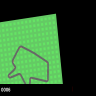
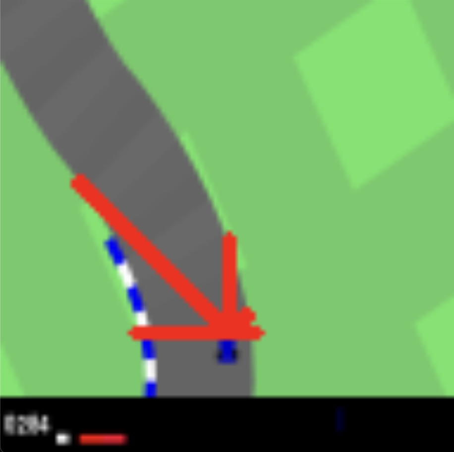
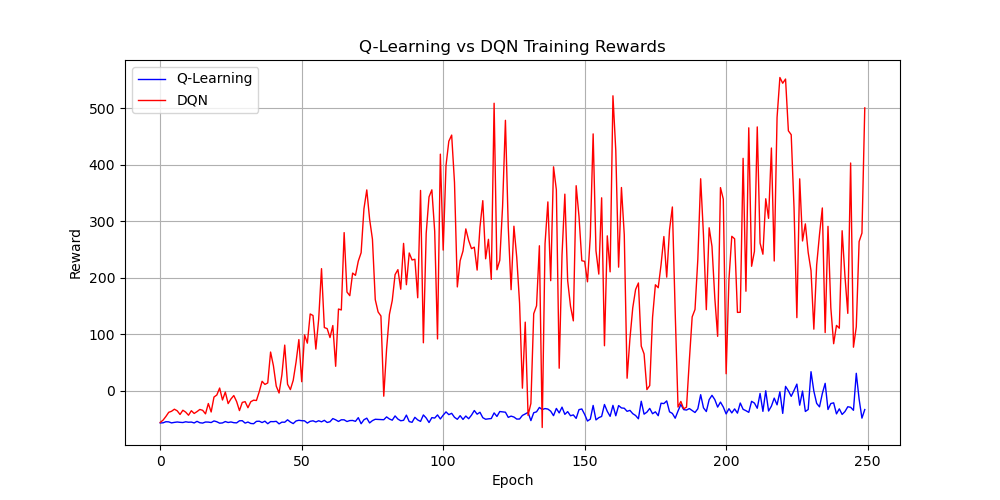
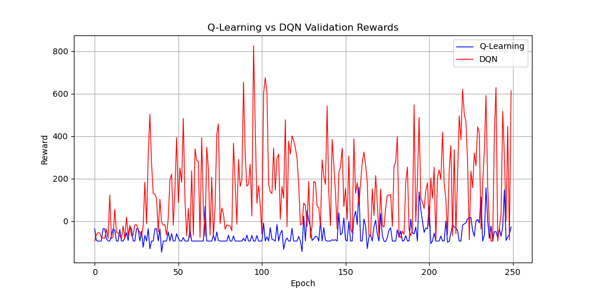
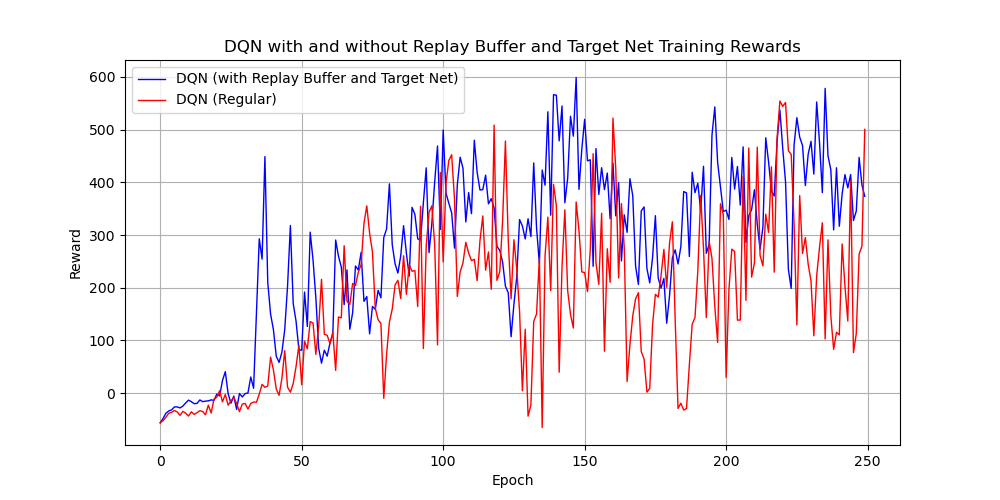
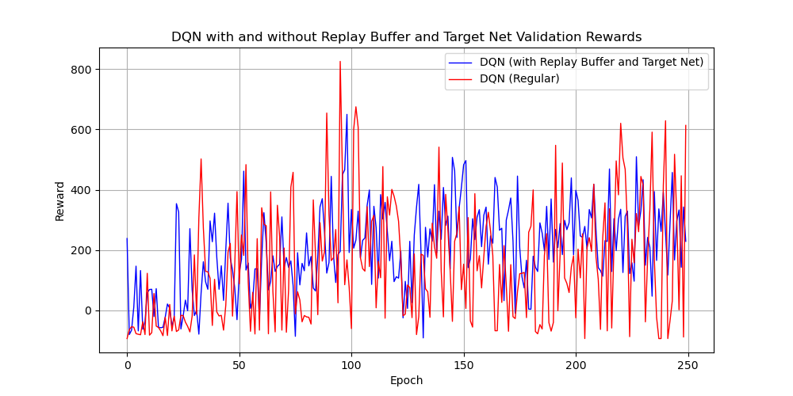
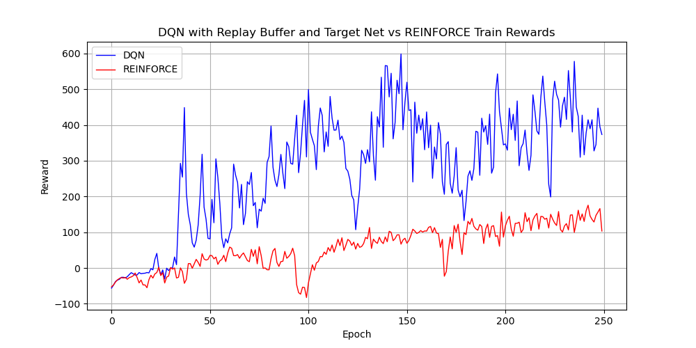
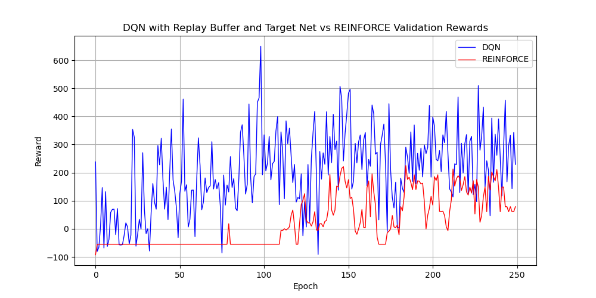
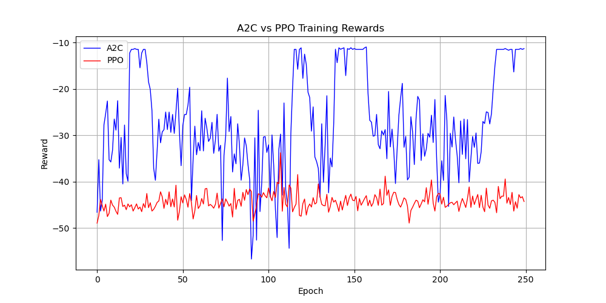
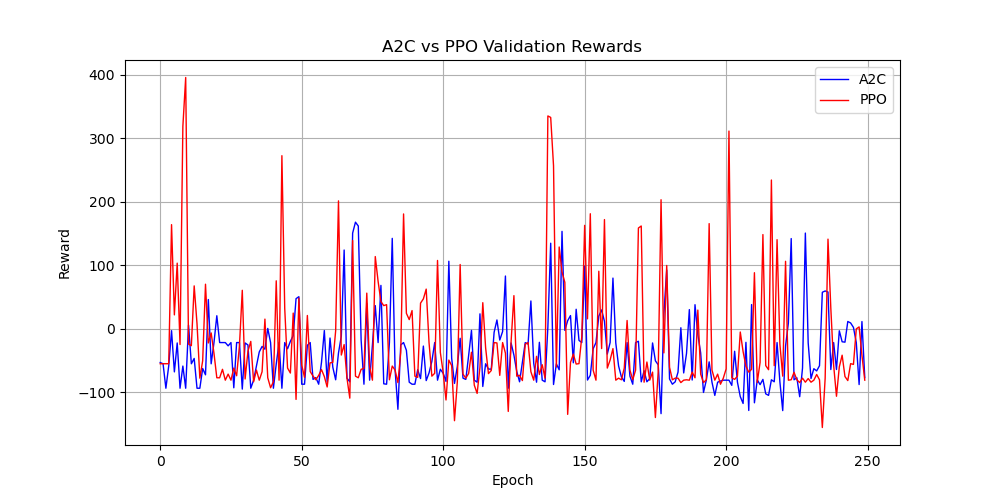

# RaceRL - an exploration of multiple Reinforcement Learning algorithms in Gymnasium's `CarRacing-v3` environment

   
  Trained DQN Agent in CarRacing-v3 Environment

Over the past months, I have become increasingly interested in reinforcement learning (RL) and how it can solve many different tasks just by receiving feedback from a pre-determined environment. Curious to explore, I wanted to give a shot at implementing different RL algorithms to understand the strengths and weaknesses of each, and develop a strong understanding of concepts and best practices through having to produce these algorithms. 

I settled with CarRacing because a) I'm an avid motorsports fan! and b) because I could use a simple radar rather than the image pixels for training data. Many implementations (and DeepMind's Atari with Reinforcement Learning paper) use the pixels in the image produced by the environment to feed the agent so it can "see", much like we do, what is going on in the game and adapt. However, I wanted to have as small of a non-RL pipeline as possible so I could focus on the RL side of things. Therefore, I used a radar which would calculate the radial distances from the car to the edge of the track in several directions as the main orientation mechanism for the agent, along with the speed so the car knew when to brake. This would allow for the car to know, for example, that the left wall was closer than the right wall, so it should move right. 

I used 5 rays, resulting in the car knowing these distances:

   
  Car and Radar Readings outlined on the Track

Once this was set, it was a matter of applying different algorithms, comparing, and learning more about the exciting world of RL!

## Off-Policy Algorithms

### Tabular Q-Learning

To begin, I implemented the simplest RL algorithm, tabular Q-learning. This algorithm works by having a table with all possible states, with each entry containing a Q-value. A Q-value is the expected cumulative future reward an agent will receive by taking a specific action in a given state and following optimal policy. We update using the a variant of the Bellman Equation, called the Temporal Difference (TD) update rule ( $Q(s,a) = Q(s,a) + α[r + γ * max_{a'}(Q(s',a')) - Q(s,a)]$ ), which iteratively adjusts the Q-table such that the TD error is minimised, and the Q-values approximate the expected rewards correctly. 

This algorithm has a major disadvantage, since we have to use discrete buckets for our radar and speed readings instead of using the continuous values, reducing how precise we can be in our movements. Having too few buckets reduces granularity of data, whereas having too many buckets makes the data sparse, meaning the Q-values are dictated by only a few sample points (curse of dimensionality). We save values in a dictionary, but if we were to save them in a table, we'd only use 25.63% of entries (where the size of each dimension is zero to the largest numbered bucket observed - buckets not in the data are not counted, so if using all buckets in truth this percentage would be even lower). 

Since entries on the table are independent, it is hard to extrapolate any trends between each entry. This results in the model not being able to generalise behaviour across the policy (e.g. if next to left wall turn right) because it would have to reach that conclusion in all other ray/speed combinations until it becomes a general rule. Therefore, we see a highly oscillating pattern as readings transition from one set of bucket to the next while moving.

### Deep Q-Learning

The solution to the problems highlighted above is to, instead of using a table, approximating the Q-function using a neural network, a.k.a. Deep-Q Learning (DQN). By using a neural net instead of a table, the agent can generalise better, since it can combine knowledge from different episodes to form a higher-level understanding of the environment it is in.

To convert the Q-learning update rule into something usable by a neural net, we must use a loss function which resembles the Q-learning update rule. Since our goal is to minimise the update in the function $Q(s,a) = Q(s,a) + α[r + γ * max_{a'}(Q(s',a')) - Q(s,a)]$, this means we have to make the ($r + γ * max_{a'}(Q(s',a')) - Q(s,a)$) term as small as possible. This is done by making the reward plus the scaled max possible q-value for the next step, and the q-value for the current state/action pair equal to each other. Therefore, we employ the mean squared error of $r + γ * max_{a'}(Q(s',a'))$ and $Q(s,a)$.

  

The result is a much better performance in both training and validation as we now can use continuous inputs and can use extrapolate learnings from one state to the other states in a much easier way. 

However, now we have a moving target problem, in two ways. The first is that the future q-values, Q(s',a'), are produced by the same network as the one we are updating, resulting in approximating to a value which, under the same conditions, will no longer be the same as before the training step. Then, there is also the case of instability caused by high correlation between examples. Neural nets assume that the data is independent and identically distributed. By feeding sequential data to the neural network, the updates will all be highly correlated, causing the training to have high variance as each race strongly swings the network to closely behave according to that track. It then becomes less suited for other tracks, and the process repeats, resulting in large spikes in the training reward. This causes the huge spikes in performance which can be observed in both graphs.

#### Adding a Replay Buffer and Target Network

To reduce the 2 causes of variance of DQN (highly correlated data fed in a row and moving target), we can employ two solutions:

1. Use a replay buffer to store transitions (s, a, r, s'), and sample from that buffer. By making the buffer size much larger than what a single episode (race) can collect, we can fetch random steps in minibatches from a collection of trajectories and from varying moments within each trajectory. This ensures that in a short time span, the network is exposed to many different scenarios, which approximates the i.i.d. assumption that neural networks have. Practically, this prevents the network constantly overfitting against the most recent track it has seen.

2. Use a slower-updating target network to calculate our target q-values. Unlike the online network, which goes through a training step every step, the target network is frozen to the online network's weights at the end of the previous epoch. By only updating once an epoch (every 1000 steps), the online network can, for a whole epoch, have a consistent target to work towards, which produces less spikes.

  

As we can see in the training (and to a lesser extent) in the validation rewards graphs, DQN with replay buffer and a target network tends to outperform outperforms regular DQN, and produces more stable results.

## On-Policy Algorithms

### REINFORCE

The main difference between REINFORCE and DQN is that REINFORCE is an on-policy algorithm vs DQN which is off-policy. This means that REINFORCE is updated using data generated from the current policy, which is unlike DQN, which learned from data generated from a ε-greedy policy to ensure the agent was exploring. A small alteration I performed during validation is that for on-policy algorithms I use the action with the highest probability instead of sampling the distribution, but this allows me to observe how confident the agent is in its decisions, although deviating slightly from the true on-policy learning.

By sampling actions from its policy distribution, REINFORCE introduces significant variance in the updates, as learning is based on complete trajectories that may vary widely in quality. In contrast, DQN improves stability by using a replay buffer to decorrelate samples and a target network to stabilise the learning target.

  

REINFORCE relies on sampling from its policy distribution, and as a result has high variance as each training run relies on a small amount of steps. DQN, on the other hand, uses a replay buffer and a target network to stabilise the learning target. Although this isn't immediately apparent in the reward curve comparison between these two algorithms, it is possible this is caused by the REINFORCE agent performs around 4x worse, so the difference scale might be responsible for this effect. Nevertheless, DQN clearly outperforms REINFORCE agent in this scenario.

### Actor-Critic Methods

  

For both Actor-Critic methods explained here, I will not make comparisons or reference to graphs as, for both, the critic did not converge due to excess variance, so the actor never was able to understand what were "good actions" with regards to the environment. As seen, both graphs are mostly flat, and a good policy seems to appear by chance rather than by an incremental learning process. Nevertheless, I will explain both algorithms and propose solutions to this issue, which in the future I'll implement and compare.

Actor-Critic methods work by training two neural nets, instead of one. The first one, the actor, has the task of assigning high probabilities to high-reward actions and low probabilities to low-reward actions. This corresponds to the role of the neural nets we have been training so far. The new element is the introduction of the critic, is tasked with predicting the cumulative reward we can expect given a specific state. It can then provide a baseline to the actor, from which we can calculate whether the actor's actions outperformed the baseline (good) or if they were suboptimal. This gap is called the "Advantage", calculated as $A_t=r_t+γV(s_{t+1})−V(s_t)$. The actor uses the advantage to decide whether to increase or decrease the 
log-likelihood of a certain action given some state.

#### Advantage Actor-Critic (A2C)

The explanation above goes through how the A2C algorithm essentially works. Each step the agent takes is followed by a training step to the actor/critic networks, which can introduce the bootstrapping/moving target problems explained during DQN. As a result, the critic was not able to converge on establishing an accurate action-value approximation, which meant that even if the actor had a very small loss, it is optimising a wrong estimate, so the actions won't produce good results from the environment's perspective.

A potential solution for this is to use n-step returns rather than 1-step returns, as it reduces the bias of 1-step TD and produces smoother targets. Additionally, batch training would reduce correlation between samples, and cancel out any noise arising from a single step, and allows to normalise rewards and advantages in a sample, which also stabilises training.

#### Proximal Policy Optimisation (PPO)

PPO aims to solve A2C's large gradients/updates problem through a few strategies. In terms of loss functions, the idea is still very similar - actor maximises log probability of good advantages and minimises those of bad advantages, critic aims to approximate the true value function of the environment. However, the differences lie in how it handles the data to process.

A2C exhibits instability by updating every step, which results in highly correlated and noisy batches. PPO uses multiple trajectories for each training run. This will mean that the effect of any spike in the gradients will be diminished by the rest of the data providing sensible gradient updates. Then, PPO clips the objective, which further reduces this effect and keeps the policy from drifting too much. Since we have this stability guardrail, we can train on the same data multiple times without worrying about an excessive recency bias which may arise.

The loss equation for the actor becomes: 

$$L_{CLIP}=E[min(r_t(θ)A_t, clip(r_t(θ),1-ϵ,1+ϵ)A_t)], \ \text{ where } r_t(θ) = \frac{π_θ(a_t|s_t)}{π_{old}(a_t|s_t)}$$

As for the issue with the critic not converging, something which I may implement in the future is using Generalized Advantage Estimation (GAE) instead of Monte Carlo (MC) to estimate the returns. MC uses the whole episode to be able to calculate the values for every time step. GAE, on the other hand, uses an exponential moving average of advantage estimates at different steps, which allows us to decrease variance (λ=0 for single step estimate) or decrease bias (λ=1, which is MC return). This usually tends to perform better in the context of PPO, but I wanted to use the regular MC returns first. 

## Conclusion

This has been a really enjoyable experience, and I have learned plenty about RL through this - the main thing being how important it is to include stability mechanisms to ensure the learning process is successful in practice. The plain algorithms were good to build intuition, but more advanced techniques (such as replay buffer, target network, potentially GAN) are required to achieve reliable performance. For the future, I plan on working towards extending the Actor-Critic Methods to improve stability, and compare different number of rays, along with discrete vs continuous actions.

